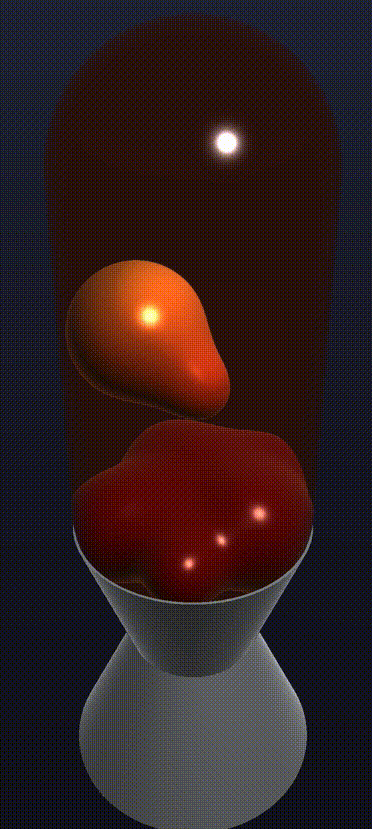

# Lava Lamp — WebGPU

A fully raymarched, GPU-simulated lava lamp, built from scratch in WebGPU + TypeScript with zero rendering libraries — no three.js, no engine, just raw `WGSL` shaders talking directly to the GPU.



## What makes this interesting

Nothing in this scene is a triangle mesh. The glass, the wax, and the metal base are all **signed distance functions (SDFs)** — pure math describing "how far is this point from the nearest surface" — rendered by **raymarching**: walking a ray outward from the camera one safe step at a time until it hits something. That single technique is what makes the whole scene possible:

- **The wax blobs merge and separate like real fluid** using a smooth-minimum blend between multiple sphere SDFs — no particle system, no mesh deformation, just blending distance values.
- **The physics simulation runs entirely on the GPU**, in a WGSL compute shader — buoyancy, wall repulsion, and blob-blob repulsion are all computed in parallel on the GPU every frame, never touching the CPU.
- **The glass container** fakes refraction and Fresnel reflectivity (the way real glass gets more mirror-like at grazing angles) without ever bending a ray — a cheap trick that looks convincingly real.
- **Bloom, height-based lava coloring, and a metallic base** are all built as additional shader passes and SDF primitives layered on top of the same core raymarching loop.
- **The blob count is live-adjustable** (1–24) via an on-screen GUI, which requires actually *recompiling the WGSL shader* on the fly, since WGSL array sizes and workgroup sizes have to be known at compile time — a genuinely tricky constraint to design around.

Everything — the camera, the lighting, the container, the simulation — was built incrementally from first principles, starting from a blank canvas and a single hardcoded triangle. See [`LESSON_PLAN.md`](LESSON_PLAN.md) for the full step-by-step build log, if you want to see (or follow) how it was constructed one concept at a time: rasterization → SDFs → compute shaders → raymarching → lighting → post-processing.

## Controls

- **Drag** on the canvas to orbit the camera (mouse or touch); release to resume gentle auto-rotation.
- The **control panel** (top right) exposes live tuning for blob count, animation speed, light position, lava colors, and raymarching quality/performance.

## Running it locally

```sh
npm install
npm run dev
```

WebGPU requires a [secure context](https://developer.mozilla.org/en-US/docs/Web/Security/Secure_Contexts) — the dev server is configured for HTTPS out of the box (via `vite-plugin-mkcert`) so it works over `https://localhost:5173` and from other devices on your LAN.

You'll need a browser with WebGPU support: recent Chrome or Edge, Safari 18+, or Firefox with WebGPU enabled.

## Stack

TypeScript + [Vite](https://vitejs.dev/), raw [WebGPU](https://www.w3.org/TR/webgpu/) (no rendering library), [Tweakpane](https://tweakpane.github.io/docs/) for the tuning UI.
